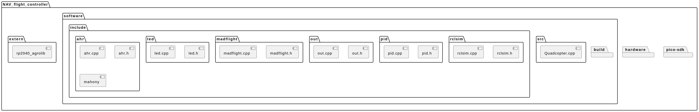

# RP2040 Flight Controller Build Guide

## Build Submodule: `RP2040_AGROLIB`

```sh
cd extern/rp2040_agrolib/software/scripts
./build.sh
```

## Build `NAV_flight_controller`

```sh
cd software/build
cmake ..
make
```

## Upload to RP2040

```sh
cp /home/chaves/Documentos/NAV_flight_controller/software/build/quadcopter_flight_controller.uf2 /media/chaves/RPI-RP2
```


